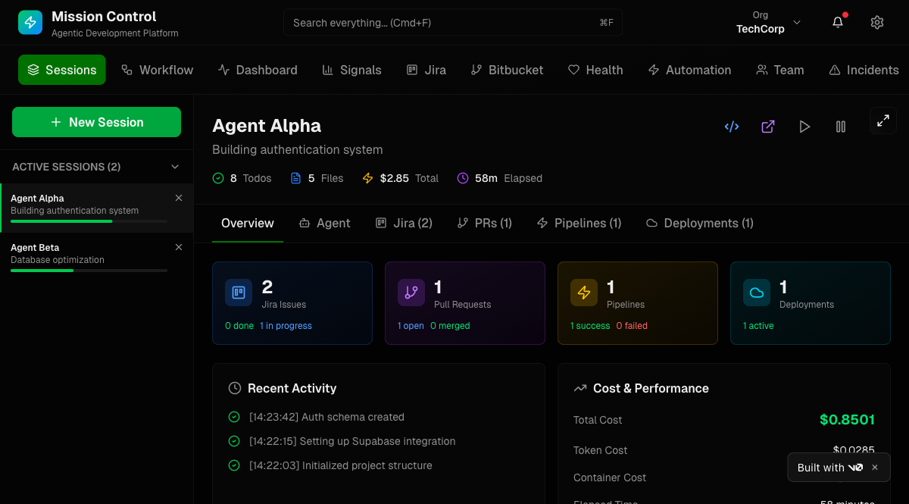
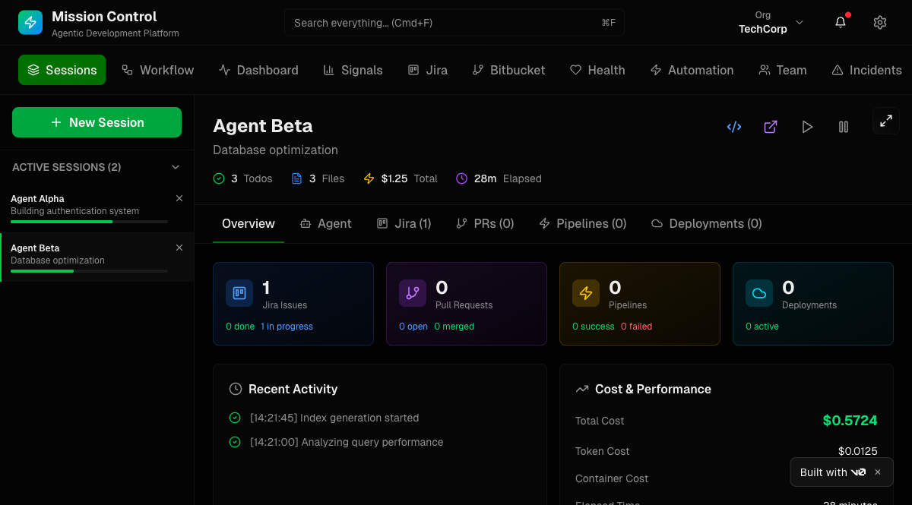
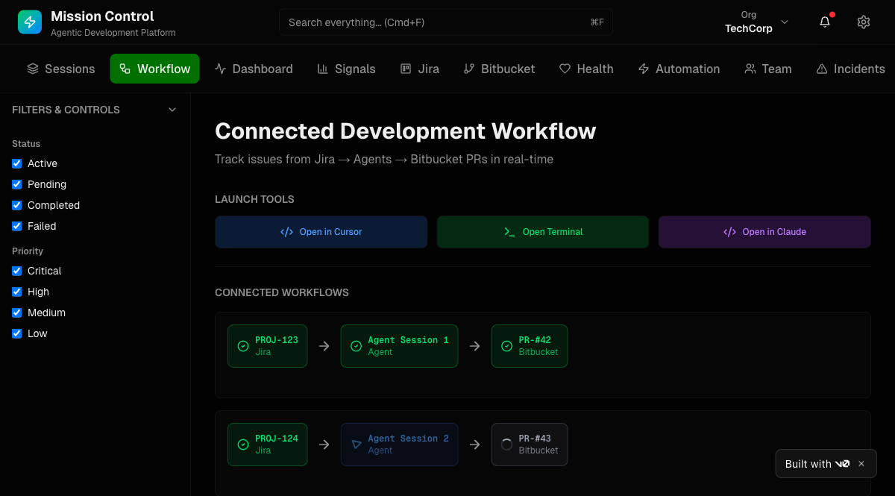

# Early Prototype References

**Screenshots:** [v0-prototype/](v0-prototype/)

---

## 1. V0 Prototype -- "Mission Control"

**Source:** https://v0-gmc-gold.vercel.app/
**Date:** Early 2026 (pre-design-spec exploration)

## What It Was

A v0-generated prototype exploring an enterprise "Mission Control" concept for Ark. Horizontal top nav with 15 tabs (Sessions, Workflow, Dashboard, Signals, Jira, Bitbucket, Health, Automation, Team, Incidents, Integrations, Debug, Knowledge, Org & Team, Dependencies). Single dark-green theme, TechCorp org branding.



## Key Patterns Worth Carrying Forward

### 1. Integration-Aware Session Overview

The Session Detail had an Overview tab with 4 status cards showing real-time counts from connected tools:

| Card | Content |
|------|---------|
| Jira Issues | count, done/in-progress breakdown |
| Pull Requests | count, open/merged breakdown |
| Pipelines | count, success/failed breakdown |
| Deployments | count, active status |



**Design principle: these cards must be contextual to the org's configured integrations.** Not every team uses Jira -- some use GitHub Issues, Linear, or nothing. Not every team uses Bitbucket -- some use GitHub, GitLab. The overview surface should dynamically render cards only for integrations the team has actually connected.

Possible integration surfaces:

| Category | Options |
|----------|---------|
| Issue tracker | Jira, GitHub Issues, Linear, GitLab Issues, Shortcut |
| Source control | GitHub, Bitbucket, GitLab |
| CI/CD | GitHub Actions, Bitbucket Pipelines, GitLab CI, Jenkins, CircleCI |
| Deployments | Vercel, AWS, GCP, Kubernetes, ArgoCD |
| Communication | Slack, Teams, Discord |

Each integration provides a typed card renderer. No integrations configured = no overview tab (or a setup prompt).

### 2. Connected Workflow Graph

The Workflow page showed a horizontal pipeline: `PROJ-123 (Jira) -> Agent Session 1 -> PR-#42 (Bitbucket)` with status dots on each node.



This maps directly to Ark's DAG flows but rendered at a higher level -- showing the external artifacts (tickets, PRs, deploys) as nodes alongside the agent stages. This is a powerful differentiator vs Ona's linear trigger->prompt->shell->PR model.

**For Ark:** Combine the internal DAG (plan -> implement -> verify -> review -> merge) with external integration nodes to show the full end-to-end picture.

### 3. Itemized Cost Breakdown

The v0 prototype split costs into:
- **Token Cost** -- LLM API usage
- **Container Cost** -- compute runtime
- **Total Cost** -- sum

Our current design shows a single cost badge. The itemized view helps operators understand where money is going, especially for long-running sessions on paid compute (EC2, Firecracker).

### 4. Runtime Launcher Buttons

Session header had "Open in Cursor" / "Open Terminal" / "Open in Claude" buttons. Quick-jump to the runtime where the agent is actually working. Relevant for Ark since sessions can run on different runtimes (Claude Code, Codex, Gemini CLI, Goose).

### 5. Session Progress Bar

A simple linear progress bar (e.g., "65%") pinned at the bottom of the session detail. Complements our DAG stage badges with a single at-a-glance metric. Could be derived from: `completed_stages / total_stages`.

## What We Deliberately Changed

| Aspect | V0 Prototype | New Design (PR #150) | Why |
|--------|-------------|----------------------|-----|
| Navigation | 15-item horizontal tab bar | 48px icon rail, 5 core items | Focus over feature sprawl |
| Session list | 2-item sidebar, minimal info | 8-card list panel with search, filters, pipeline bars, cost | Production-grade fleet view |
| Conversation | Basic chat bubble | Tool call blocks, stage transitions, code highlighting | Reflects real agent output |
| Stats | KPI tile strip (Dashboard) | Stats woven into context | No corporate dashboards |
| Theming | Single dark green | 3 themes x dark/light toggle | Operator preference |
| Keyboard | None | Cmd+K, j/k, 1-5, / | Power-user first |
| Density | Standard spacing | Compact (52px cards, 13px base) | Fleet monitoring density |

---

## 2. Product Grooming Prototype -- Stage-Based Rich Output

**Source:** Internal prototype (localhost:3333)
**Date:** Early 2026
**Context:** A product management flow where each stage produces structured output, not chat

<!-- Screenshot: grooming-side-view.png (to be added) -->

### What It Shows

A multi-stage product refinement session with:

**Left sidebar -- stage progression:**
- Intelligence (research gathering)
- Wiki & JIRA Context (completed, with timing badges)
- VOC Synthesis (completed)
- Problem Refinement (completed)
- Pre-Grooming (active, "Running...")
- "Approve & Continue" gate button at bottom

**Detail panel -- structured rich output (not conversation):**
The active "Pre-Grooming" stage renders structured sections:
- Dependency/constraint bullets (Vendor lock, Latency SLA, Privacy, Offline fallback)
- Red "Blocker" callout (contractual confirmation of telephony vendor)
- "Data & Analytics Readiness" gap analysis
- "Recommended Spike / Investigation Items" with interactive checkboxes
- "Rough Complexity Signal" with sprint allocation estimates and risk callouts
- "PM Next Step" action item

### Why This Matters for Ark

This represents a **non-SDLC flow** through Ark's DAG engine. The same session/stage/gate architecture that powers `plan -> implement -> verify -> review -> merge` can also power:

```
research -> PRD -> design planner -> mockups -> ... -> implementation
```

Key design implications:

1. **Stage sidebar as primary nav (not session list):** When viewing a session in this mode, the left panel shows the flow's stages with completion status -- not a list of other sessions. This is a detail-view variant where the DAG itself becomes the navigation.

2. **Rich output renderers per stage type:** Each stage can produce different output formats:
   - Code stages -> conversation + terminal + diff (current mockups)
   - Research stages -> structured findings with citations
   - PRD stages -> requirement tables, gap analysis, blockers
   - Design stages -> mockup renders (via Figma MCP, v0, etc.)
   - Grooming stages -> complexity estimates, spike recommendations, checklists

3. **Interactive elements in output:** Checkboxes, approve/reject buttons, editable fields within the stage output. Not just read-only -- the operator can interact with stage results before gating to the next stage.

4. **Tool-contextual output:** Just like integration cards are contextual to the org's tools, stage output format depends on the connected MCPs:
   - Figma MCP connected -> design stages render Figma embeds
   - Jira MCP connected -> grooming stages link to/create Jira tickets
   - GitHub MCP connected -> implementation stages show PR status

### Generalized Flow Types

| Flow | Stages | Output Type |
|------|--------|-------------|
| SDLC | plan -> implement -> verify -> review -> merge | Conversation, terminal, diff |
| Product Refinement | research -> VOC -> problem -> grooming -> planning | Structured docs, gap analysis, estimates |
| Design | research -> PRD -> design -> mockups -> review | Figma embeds, visual comparisons |
| PR Review | fetch -> analyze -> comment | Structured review, inline annotations |
| Incident Response | detect -> investigate -> mitigate -> postmortem | Structured findings, timelines |

The web UI should handle all of these -- the session detail view adapts its panel layout and renderers based on the flow type and stage.

---

## Design Takeaways -- Combined

### For the Session Detail View

1. **Add Overview tab** -- contextual integration cards based on org's connected tools
2. **Stage sidebar variant** -- for non-SDLC flows, show stage progression as left nav instead of session list
3. **Rich output renderers** -- per-stage typed output (structured docs, not just chat)
4. **Interactive stage output** -- checkboxes, approve/reject, editable fields within rendered content
5. **Runtime launcher** -- "Open in [runtime]" button in session header

### For the Workflow/Flow View

6. **Connected workflow graph** -- DAG with external integration nodes (tickets, PRs, deploys)
7. **Flow type selector** -- SDLC, Product Refinement, Design, PR Review, etc.

### For Cost/Progress

8. **Itemized cost breakdown** -- token/compute split on hover or in detail row
9. **Progress derivation** -- `completed_stages / total_stages` as bar or badge

### For Integration Architecture

10. **Contextual surfaces everywhere** -- cards, output renderers, stage types all adapt to the org's connected tools. No hardcoded Jira/Bitbucket assumptions.
